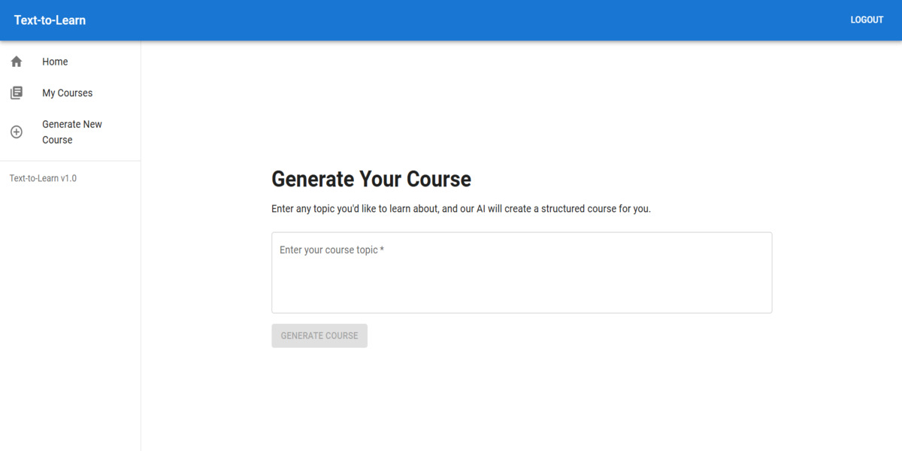

# Text to Learn Course Generator



## Table of Contents

* [Introduction](#introduction)
* [Features](#features)
* [Technologies Used](#technologies-used)
* [Architecture](#architecture)
* [CI/CD Pipeline](#cicd-pipeline)
* [Live Demo](#live-demo)
* [Getting Started (Local Development)](#getting-started-local-development)
    * [Prerequisites](#prerequisites)
    * [Cloning the Repository](#cloning-the-repository)
    * [Environment Variables](#environment-variables)
    * [Install Dependencies](#install-dependencies)
    * [Run the Application](#run-the-application)
* [Deployment](#deployment)
* [Contributing](#contributing)
* [License](#license)

## Introduction

The **Text to Learn Course Generator** is a full-stack, AI-powered platform designed to revolutionize content creation for education. Users can provide a topic, and the application leverages large language models (LLMs) like Google Gemini to dynamically generate comprehensive, structured learning courses complete with modules, lessons, rich content, and interactive quizzes. It provides an engaging and personalized learning experience, allowing users to access and even download lessons offline.

## Features

* **AI-Powered Course Generation:** Generates multi-module, multi-lesson course outlines and detailed lesson content from a single user-provided topic prompt using advanced LLMs (Gemini/GPT).
* **Interactive Lesson Rendering:** Dynamically renders diverse content types including rich text (with Markdown support), syntax-highlighted code blocks, embedded dynamic YouTube video suggestions, and interactive Multiple-Choice Questions (MCQs).
* **Offline Access:** Provides PDF export functionality for lessons, allowing users to download and review content offline.
* **User Authentication & Personalization:** Secure user authentication with Auth0, enabling personalized course dashboards and tracking of user-generated content.
* **Dynamic YouTube Video Caching:** Fetches and caches YouTube video metadata on-demand within the database, reducing API calls and improving load times for video content.
* **Modular & Scalable Architecture:** Designed with a clear separation of concerns (frontend/backend) within a monorepo structure, deployed on cloud platforms for scalability and maintainability.

## Technologies Used

The project is built using the MERN stack, leveraging various modern technologies:

**Frontend (Client):**
* **React.js:** A JavaScript library for building user interfaces.
* **Vite:** A fast build tool for modern web projects.
* **Material-UI (MUI):** A popular React UI framework for beautiful and responsive designs.
* **React Router:** For declarative routing in the application.
* **`react-markdown`:** For rendering Markdown content within lessons.
* **`html2canvas` & `jspdf`:** For client-side PDF generation.
* **`react-syntax-highlighter`:** For syntax highlighting of code blocks.
* **`axios`:** For making HTTP requests to the backend.

**Backend (Server):**
* **Node.js:** JavaScript runtime environment.
* **Express.js:** A fast, unopinionated, minimalist web framework for Node.js.
* **MongoDB:** A NoSQL database for flexible data storage.
* **Mongoose:** An ODM (Object Data Modeling) library for MongoDB and Node.js.
* **`googleapis`:** Google API client library for Node.js (used for YouTube Data API).
* **`dotenv`:** For loading environment variables.
* **`cors`:** For enabling Cross-Origin Resource Sharing.

**AI & Authentication:**
* **Google Gemini API:** For large language model capabilities (content generation).
* **Auth0:** For secure user authentication and authorization.

**Deployment & CI/CD:**
* **Vercel:** For seamless frontend deployment and continuous integration/delivery.
* **Render:** For robust backend deployment and continuous integration/delivery.
* **GitHub:** For version control and hosting the repository.

## Architecture

The project follows a **MERN stack** architecture within a **monorepo** structure:

* **`client/`**: Contains the React.js frontend application.
* **`server/`**: Contains the Node.js/Express.js backend API and MongoDB models.

This separation allows for independent development, deployment, and scaling of the frontend and backend components.

## CI/CD Pipeline

The project implements an automated CI/CD pipeline using the native integrations of Vercel and Render with GitHub:

* **Frontend (Vercel):** Automatically builds and deploys the `client/` application to Vercel upon every push to the `master` branch on GitHub. Preview deployments are also available for feature branches.
* **Backend (Render):** Automatically builds and deploys the `server/` application to Render upon every push to the `master` branch on GitHub.

This setup ensures rapid iteration, consistent builds, and a streamlined release cycle.

## Live Demo

Explore the live application:

* **Live Frontend:** [https://text-to-course.vercel.app/](https://text-to-course.vercel.app/)
* **Live Backend API Base URL:** [https://texttocoursebackend.onrender.com](https://texttocoursebackend.onrender.com)
    *(You can test endpoints like `GET /api/courses` or `GET /api/lessons/:lessonId` by appending them to this base URL in your browser or a tool like Postman/Insomnia.)*

## Getting Started (Local Development)

Follow these steps to set up and run the project on your local machine.

### Prerequisites

* [Node.js](https://nodejs.org/en/) (v18 or higher recommended)
* [npm](https://www.npmjs.com/) (comes with Node.js) or [Yarn](https://yarnpkg.com/)
* [MongoDB](https://www.mongodb.com/try/download/community) (Community Server or a cloud service like MongoDB Atlas)
* [Git](https://git-scm.com/downloads)

### Cloning the Repository

```bash
git clone https://github.com/YashM211/TextToCourse.git
cd TextToCourse
```
### Environment Variables

You need to create `.env` files for both the `server` and `client` directories.

#### `server/.env`

Create a file named `.env` inside the `server/` directory and add the following:

```env
PORT=5000
MONGODB_URI=your_mongodb_connection_string # e.g., mongodb://localhost:27017/texttolearn
YOUTUBE_API_KEY=your_youtube_data_api_key
AI_API_KEY=your_google_gemini_api_key
AI_ENDPOINT=your_google_gemini_api end point
AUTH0_AUDIENCE=your_auth0_api_audience # e.g., [https://your-domain.auth0.com/api/v2/](https://your-domain.auth0.com/api/v2/)
AUTH0_DOMAIN=your_auth0_domain # e.g., dev-abc123xyz.us.auth0.com
```
Replace placeholders with your actual credentials.
* For `MONGODB_URI`, use your local MongoDB connection string or your MongoDB Atlas connection string.
* Obtain `YOUTUBE_API_KEY` and `GEMINI_API_KEY` from Google Cloud Console.
* Obtain Auth0 credentials from your Auth0 dashboard.

#### `client/.env`

Create a file named `.env` inside the `client/` directory and add the following:

```env
VITE_BACKEND_API_URL=http://localhost:5000/api # Or your Render backend URL for testing deployed backend
VITE_AUTH0_DOMAIN=your_auth0_domain # e.g., dev-abc123xyz.us.auth0.com
VITE_AUTH0_CLIENT_ID=your_auth0_client_id
VITE_AUTH0_AUDIENCE=your_auth0_api_audience # Must match backend's AUTH0_AUDIENCE
VITE_AUTH0_CALLBACK_URL=http://localhost:5173 # Or your Vercel frontend URL for deployed frontend
```
Replace placeholders with your actual credentials.
* `VITE_API_BASE_URL` should point to your local backend (`http://localhost:5000/api`) for local development.
### Install Dependencies

Navigate into both the `server` and `client` directories and install their respective dependencies.

```bash
# Install backend dependencies
cd server
npm install
cd .. # Go back to project-root

# Install frontend dependencies
cd client
npm install
cd .. # Go back to project-root```
### Run the Application
```
You need to start both the backend server and the frontend development server.

```bash
# In the project-root directory, open two separate terminal windows.

# Terminal 1: Start Backend Server
cd server
npm start # Or 'node server.js' or 'npm run dev' depending on your package.json scripts

# Terminal 2: Start Frontend Development Server
cd client
npm run dev # Or 'npm start' depending on your package.json scripts
```
The frontend application will typically be available at `http://localhost:5173` (or another port if Vite configures it differently), and the backend API will be running on `http://localhost:5000`.

## Deployment

The project is deployed using a continuous deployment workflow:

* **Frontend:** Hosted on [Vercel](https://vercel.com/). Automatic deployments are triggered on every push to the `main` branch of the `client/` directory in the GitHub repository.
* **Backend:** Hosted on [Render](https://render.com/). Automatic deployments are triggered on every push to the `main` branch of the `server/` directory in the GitHub repository.

## Contributing

Contributions are welcome! If you have suggestions for improvements or new features, please open an issue or submit a pull request.

1.  Fork the repository.
2.  Create your feature branch (`git checkout -b feature/AmazingFeature`).
3.  Commit your changes (`git commit -m 'Add some AmazingFeature'`).
4.  Push to the branch (`git push origin feature/AmazingFeature`).
5.  Open a Pull Request.